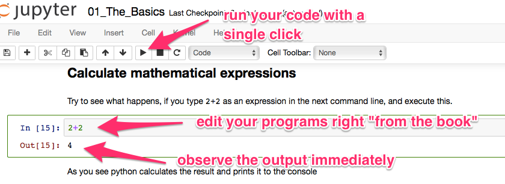
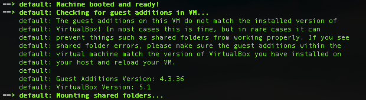
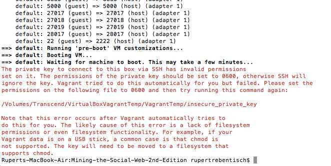
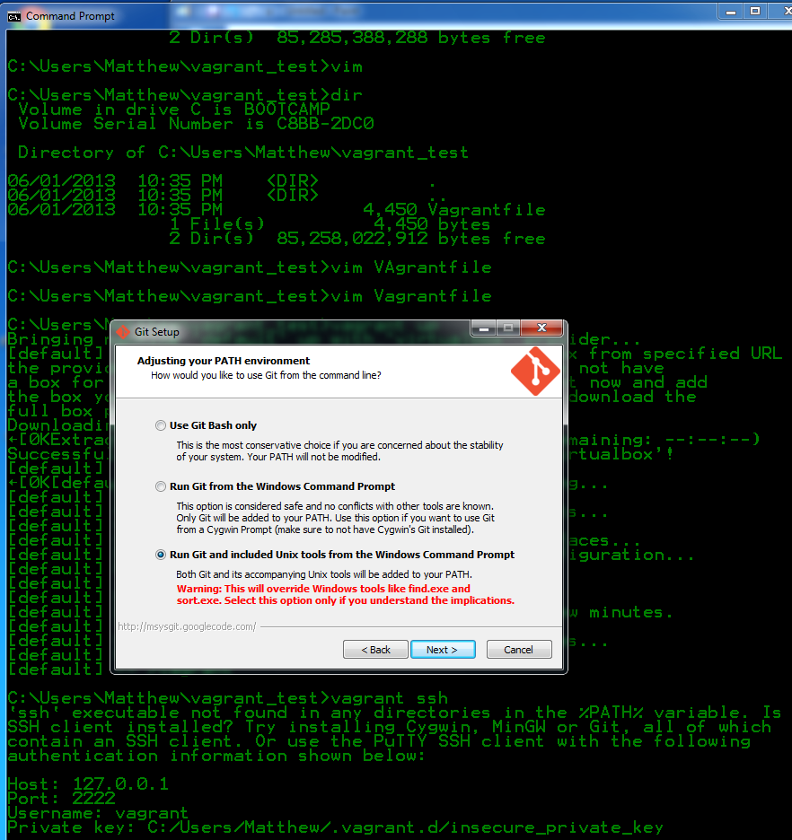

basket4py
=================

## A python environment with anaconda and vagrant
This project gives you an easy start with python:
+ Develop your python scripts within jupyter notebooks
+ Use a full blown anaconda stack for data science task
+ Visualize you data with
    * Matplotlib
    * seaborn
+ The whole environment is setup within a virtual linux box, so your computer won't be impacted by any installation of the python environment.
+ The provisioning is done with chef. So the chef recipes can easily be customized
+ Everything is based on virtualbox and vagrant. So the whole setup is portable from one computer to the next and works independently from your OS (i.e. it works as well with OSX as with windows)


## Integrated platform to edit and run your programs



## How to get started
### Installation
If you know how to insall programs on a Mac or PC, you should be able to get everything up and running. If not, ask someone to help you.

Follow these simple steps to install everything you need to start programming:
1. install [virtual box](https://www.virtualbox.org/wiki/Downloads).
* install [vargrant](https://www.vagrantup.com/downloads.html).
* Copy the [zipfile from Github](https://github.com/rreben/basket4py/). And extract it somewhere.
* Use a terminal (dos-prompt / cmd) and navigate to the folder that contains the extracted files. You should find a file named `vagrantfile`.
* type in `vagrant up`. This command will prepare a "virtual computer" on your pc or mac. Everything will be installed within this "virtual computer" so there won't be any interferences with other programs on your mashine.
* type in `vagrant provision` this command may take even longer (leave it for the night). It will install a modern python development environment.

### Check the installation
After the installation. Use [http://localhost:8888](http://localhost:8888) in your web browser, to start the environment. Click on the notebook and run the code blocks in the order in which they occur in the notebook.

## Stoping and resuming
* Use `vagrant status` to check whether the vagrant machine is up and running.
* start and stop vagrant via `vagrant up` and `vagrant halt` (do not use `vagrant suspend` in most cases)
* Use `vagrant destory` if you have to restart completly from scratch or have to reuse the disk space.

## Behind the scenes
* Vagrant is used to install python 3, jupyter and some other tool from the Anaconda eco system to a virtual mashine.
* Vagrant is instructed to use chef as the provisioner.
* The virtual machine is provided via Oracles virtual box.
* A web server is running on the virtual (guest) computer. This server serves the jupyter notebooks.
* These notebooks can be accessed via port forwading from the host computer.
* This way all the tutorials are brought to the users browser.

## Acknowledgement
This work is inspired by Matthew A. Russel's work on [Mining the social Web](https://miningthesocialweb.com), where I found out about iPython (now jupyter) and how to use Vagrant and chef to prepare an easy to deploy development environment.

I used the following chef recipes to cook up the development environment:
* [anaconda](https://github.com/thmttch/chef-continuum-anaconda)
* [apt](https://github.com/chef-cookbooks/apt)
* bzip2 chef cookbook from John Bellone
* compat chef cookbook from John Keiser
* [packagecloud](https://github.com/computology/packagecloud-cookbook')
* runit chef cookbook from the Heavy Water Operations, LLC.
* tar chef cookbook from the Cramer Development, Inc.


## Status
* The vagrantfile is done, so setting up the development environment is working. Some tweeks to the chef recipes have been necessary to point the jupyter working directory to the right directory that is linked from the guest machine directly to the host machine.
* basket4py has been tested with vagrant 1.9.x
* The anaconda stack is working


## Handling errors
### Problems with mounting the directories / Guest additions do not match
You might see a warning while vagrant up, telling you that guest additions do not match the version of the virtual box.



The effect might be that the directories with the jupyter notebooks are not mounted correctly. In this case you will see that jupyter is running (localhost:8888 will show a webpage), however you will not see any meaningful tutorials.

If this happens, you have to update your virtualbox installation to the newest version. Use `vagrant destroy` to restart from scratch, use `vagrant up` to install again (do this in a strong wifi network). This should fix everything.

#### Tips for analyzing errors
In most cases, this should solve your problems. But if the message "The guest additions on this VM do not match the installed version of VirtualBox! ..." persists, you might try to issue. `vagrant plugin install vagrant-vbguest` and restart vagrant. This might indicate further problems with the guest additions.

Use `vagrant ssh` to login to your guest mashine. Here you might issue `ipython notebook --help` to learn more about starting the jupyter service.

### Other bugs and errors
Your stuck with the installation. Please create an issue on Github, I will try to help you then.

### Twitter sent status 401 ... Timestamp out of bounds
It might happen that the guest machine is not working with the correct system time. This will lead issues with various APIs especially the twitter API. Just do a `vagrant halt` followed with `vagrant up` to sync the time of the guest machine again.

## Some tips and tricks to deal with disk space

### Move away from the primary disk
On my Windows 7 mashine the VMBox takes up about 1.5 to 5 GB of diskspace, vagrant uses around 750 MB. As I have a SSD as my first disk, I need to move this to my secondary disk.
To achieve this:
1. Create a new directory on your target disk. Set the VAGRANT_HOME environment variable to point to this directory. On Windows go to explorer (right click) -> "Erweiterte Systemeinstellungen" -> "Umgebungsvariablen".
2. Create a different new directory on your target disk for your VirtualBox. Open the VirtualBox app. In the settings, specify this directory to store the VirtualBox-files.

### Move VirtualBox to a flash-drive
On my MacBook I need to have ghe VirtualBox on a flash-drive. This leads however to some obstacles: vagrant will not be able to provision the virtual mashine, because the certificate to log in to the virtual box is fully accessible. For security reasons ssl
will not accept a fully accessible certificate, so vagrant can not log in to its created guest machine.
So after using `vagrant up` to download and install the virtual machine (takes 20 min) there might be an error with the permissions on the private-key file for the ssh to the virtual machine.

In this case do the following:
  * let us assume that /project is the folder where the vagrant file lives.
  * So then goto /project/.vagrant/mashines/default/virtualtbox and copy the file to a local folder /home folder (let us assume /Users/username/certificates/), where you can change the file permissions via `chmod 0600 key_file`
  * now set the vagrant system to find the file in this folder:
  * open the vagrant file and add the last line below the two lines (so this block look as follows:)
  ```sh
  override.vm.box = "precise64"
  override.vm.box_url = "http://files.vagrantup.com/precise64.box"
  config.ssh.private_key_path = "/Users/username/certificates/private_key"
  ```
  * Note: with version 1.8.5 of vagrant the behaviour changed a little:
    * The key file will now be named `insecure_private_key`
    * Vagrant will try to substitute this key file with a different secure key file, however this will lead to unrecoverable errors. So you have to add the following lines to the vagrant (or uncomment and adapt the lines in the vagrant file).
    ```sh
    override.vm.box = "ubuntu/trusty64"
    config.ssh.private_key_path = "/Users/username/certificates/insecure_private_key"
    config.ssh.insert_key = false
    ```
  * Note: After using `vagrant destroy`  you first have to deactivate config.ssh.private_key_path again in the Vagrantfile, because the next `vagrant up` will create a new guest virtual machine, with a new and different certificate.


### Install of vagrant and virtual box for a secondary disk
  * install [virtual box](https://www.virtualbox.org/wiki/Downloads). The target directory is fixed Unfortunately (Mac).
  * install [vargrant](https://www.vagrantup.com/downloads.html). The can be changed to point to a flash drive (Mac).
  * install git client for Windows. Do check (it's guarded by a warining) the git and bash command linen tools. Otherwise `vagrant ssh` will not work at all (Windows). Alternatively you could use putty to login to your guest machine.
  
  * clone the github repo from [GitHub](https://github.com/ptwobrussell/Mining-the-Social-Web-2nd-Edition/)

## Use some basic vagrant commands
  * Use `vagrant up` to download and install the guest machine (also use this to bring the virtual machine up after halt or suspend)
  * Use `vagrant status` to check whether the vagrant machine is up and running.
  * you might have to update via `vagrant box update`
  * start and stop vagrant via `vagrant up` and `vagrant halt` (do not use `vagrant suspend` in most cases)
  * use `vagrant provision` to start the provisioning of the machine. In our case this will start the chef machinery to install the python environment. You can restart this command.
  * Use `vagrant destory` if you have to restart completly from scratch or have to reuse the disk space.

## Maintenance
  * go to the folder that contains the vagrantfile and isue `vagrant plugin install vagrant-vbguest`
  * see this [blog](http://kvz.io/blog/2013/01/16/vagrant-tip-keep-virtualbox-guest-additions-in-sync/) for details.


## Get in touch
* Use Github to open tickets for support questions.
* Follow me on Twitter `@r_rbn`
* Tweet using `#basket4py`. Or send me a DM.
* Forking, starring, following the github repo would be great.
